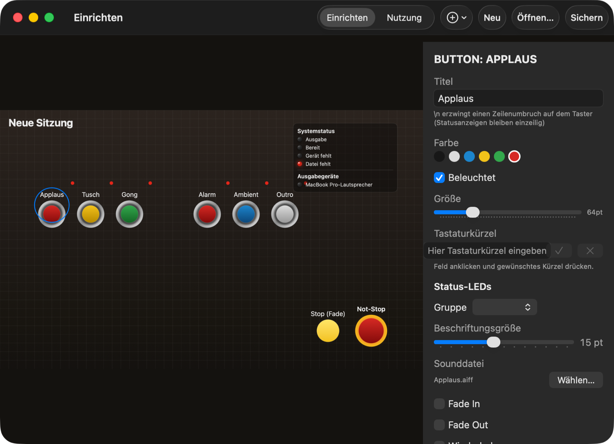
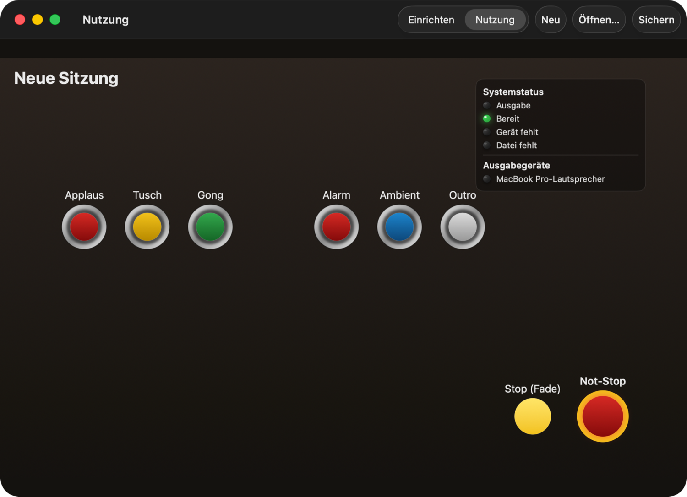

# SoundBoard

Kleines, schnelles Privatprojekt: eine macOS-Soundboard-App im Design eines Doppelmayr-Seilbahn-Bedienpults ("AS-P"). Runde beleuchtete Industrie-Taster, Status-LEDs, roter Not-Halt-Taster — Buttons spielen zugewiesene Sounddateien ab, erneuter Klick stoppt die Wiedergabe.

|Einrichten|Nutzung|
|---|---|
|||

## Funktionen

- **Zwei Bedienebenen:** Einrichten (Buttons platzieren, Sounddatei zuweisen, Einstellungen) und Nutzung (reduzierte Oberfläche, nur Wiedergabe).
- **Freies Canvas** mit Snap-to-Grid für saubere, aber individuelle Button-Anordnung.
- **Pro Button:** Fade In/Out, Wiederholung, Lautstärke, Hold-to-Play.
- **Kanalgenaues Audio-Routing** pro Button (z. B. Kanal 3/4 eines Multikanal-Interfaces/Digitalmischpults) statt nur einfacher Geräteauswahl.
- **Status-LEDs:** globale Anzeige für Ausgabegerät/Dateien verfügbar, eigene LED-Spalte pro Button (Wiedergabe/Fade/kurz vor Ende), jeder beleuchtete Button zeigt seinen Status selbst an.
- **Stop** (Fade-Out aller Sounds) und separater **Not-Stop** (sofortiger Stopp).
- **Sitzungen** lassen sich speichern und wieder öffnen; Sounddateien werden nur referenziert, nicht kopiert.

## Voraussetzungen

- macOS
- Xcode (zum Bauen aus dem Quellcode)

## Build & Start

```
open SoundBoard.xcodeproj
```

In Xcode bauen und starten, oder die gebaute App aus dem jeweils aktuellen [Release](../../releases) laden. Releases sind nicht signiert/notarisiert — macOS Gatekeeper warnt beim ersten Start (Rechtsklick → Öffnen, oder in Systemeinstellungen → Datenschutz & Sicherheit freigeben).

Die App läuft bewusst ohne App-Sandbox, da freier Dateizugriff (Sounddatei-Referenzen) und direktes Core-Audio-Kanal-Routing gebraucht werden.

## Status

Privatprojekt in aktiver Entwicklung. Noch nicht vollständig interaktiv in der laufenden App getestet; kanalgenaues Routing ist bisher nur gegen Zweikanal-Geräte verifiziert.

## Lizenz

[EUPL-1.2](LICENSE)
